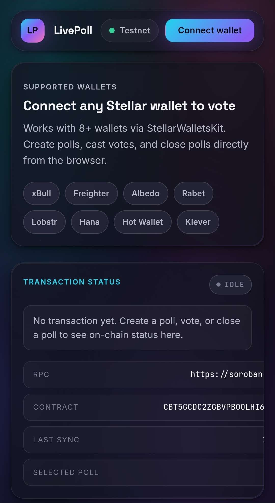

# LivePoll

LivePoll is a mini end-to-end Stellar + Soroban dApp: a multi-wallet polling app backed by a deployed Soroban smart contract on Stellar Testnet, with real-time contract event sync, transaction progress feedback, basic caching, and a small automated test suite.

## Level 3 Submission Checklist 

- Live demo link: https://online-live-poll-liard.vercel.app/
- Public GitHub repository : https://github.com/AYUSHKRSHARMA4986/online-live-poll-lvl3
- Demo video link : https://drive.google.com/file/d/1SR8RxqQMYTR2mG-opvBFGaUaCffiQFiw/view?usp=sharing
- README with complete documentation : ✅ (DONE BELOW)
- Minimum 10+ meaningful commits : ✅ (DONE)
- Screenshot showing (Mobile responsive UI , CI/CD pipeline running , Test output with 3+ passing tests) : ✅ (DONE BELOW)
- Deployed contract address : ✅ (DONE BELOW)
- Transaction hash of a contract call (verifiable on Stellar Explorer) : ✅ (DONE BELOW)

## Submission Overview

This project demonstrates:

- Multi-wallet integration with `StellarWalletsKit`
- Smart contract deployment on Stellar Testnet
- Contract reads and writes from the frontend
- Real-time event polling and state synchronization
- Visible transaction lifecycle feedback
- Wallet error handling for missing wallet, rejected request, and insufficient balance
- Loading states and progress indicators during reads/writes
- Basic caching of recently loaded poll data in `localStorage`
- Automated tests for core helper logic

## Key Features

- Connect with supported Stellar wallets including Freighter, xBull, Albedo, Rabet, Lobstr, Hana, Hot Wallet, and Klever
- Create, vote on, close, and delete polls through frontend contract calls
- Browse contract data in read-only mode even without a connected wallet
- See transaction phases in the UI: `preparing`, `awaiting-signature`, `pending`, `success`, and `error`
- Refresh poll state automatically from recent on-chain contract events

## Screenshots

### 🏠 Home Page


### 📝 Create Poll


### 🗳️ Voting Interface


### ⚙️ CI/CD Workflow


## Mobile responsive screenshots

Below is a mobile view screenshot demonstrating the responsive layout on narrow screens. Replace the placeholder with a real phone-sized screenshot captured from the dev tools or a device.



## Deployed Contract

- Network: `Stellar Testnet`
- Contract address: `CBT5GCDC2ZGBVPBOOLHI6DB5UDMX33XBQMOUQAEOJNE3I5I3DCVJKOD4`
- Contract explorer: https://stellar.expert/explorer/testnet/contract/CBT5GCDC2ZGBVPBOOLHI6DB5UDMX33XBQMOUQAEOJNE3I5I3DCVJKOD4

## Verifiable Contract Call

- Deploy tx hash: `9cc1509985bdd889c47f02e0cf5b29b39a4be3c61d363a60e841ffa3b8a10c62`
- Stellar Expert link: https://stellar.expert/explorer/testnet/tx/9cc1509985bdd889c47f02e0cf5b29b39a4be3c61d363a60e841ffa3b8a10c62
- Sample `create_poll` tx hash: `1fd899d9a98e7b262ec7ed357add3d65e7470808d2c715bcb73a94b0b6c69e2d`
- Stellar Expert link: https://stellar.expert/explorer/testnet/tx/1fd899d9a98e7b262ec7ed357add3d65e7470808d2c715bcb73a94b0b6c69e2d

## Smart Contract Source
To verify the custom logic of the LivePoll smart contract (beyond boilerplate), please review the source code and compiled WASM here:
* **Source Code:** [poll_contract/src/lib.rs](./poll_contract/src/lib.rs)
* **Compiled Contract:** *[poll_contract/target/wasm32v1-none/release/*.wasm](.poll_contract/target/wasm32v1-none/release/*.wasm)*

## Live Demo

https://online-live-poll-liard.vercel.app/

## Setup

Run all commands from the project directory.

1. Install dependencies:

```bash
npm install
```

2. Build the Soroban contract:

```bash
npm run contract:build
```

3. Sync the compiled contract WASM into the frontend (used to load the contract spec/ABI at runtime):

```bash
npm run wasm:sync
```

4. Optionally create a local env file:

```powershell
Copy-Item .env.example .env.local
```

5. Start the frontend:

```bash
npm run dev
```

6. Build for production:

```bash
npm run build
```

## Tests

Run the automated tests:

```bash
npm test
```

## Environment Variables

```env
VITE_STELLAR_RPC_URL=https://soroban-testnet.stellar.org
VITE_STELLAR_NETWORK_PASSPHRASE=Test SDF Network ; September 2015
VITE_STELLAR_CONTRACT_ID=CBT5GCDC2ZGBVPBOOLHI6DB5UDMX33XBQMOUQAEOJNE3I5I3DCVJKOD4
VITE_STELLAR_READ_ACCOUNT=
VITE_STELLAR_EXPLORER_URL=https://stellar.expert/explorer/testnet
VITE_POLL_CONTRACT_WASM_URL=/contracts/poll_contract.wasm
```

## Testnet Notes

- A connected wallet must be funded on Stellar Testnet before it can send contract transactions
- If a wallet has not been created on Testnet yet, fund it with Friendbot first and then retry
- The app can still read poll data without a funded wallet by using a temporary read account

## Scripts

- `npm run dev` starts the frontend
- `npm run build` creates a production build
- `npm run lint` runs ESLint
- `npm test` runs the Node.js test suite
- `npm run contract:build` builds the Soroban contract
- `npm run wasm:sync` copies the compiled WASM into `public/contracts/` for the frontend to load the contract spec
- `npm run contract:deploy` uploads and deploys the contract to testnet

## Deploy (Vercel / Netlify)

This is a standard Vite build.

- Node.js: use Node `^20.19.0` or `>=22.12.0` (required by Vite 8)
- Build command: `npm run build`
- Output directory: `dist`
- Set the env vars from the section above (at minimum `VITE_STELLAR_CONTRACT_ID` if you deploy a new contract)

## Demo Video (1 minute)

https://drive.google.com/file/d/1SR8RxqQMYTR2mG-opvBFGaUaCffiQFiw/view?usp=sharing

Walkthrough:

1. Open the deployed site and show the “Read from contract” panel updating.
2. Connect a wallet (Freighter or any supported wallet).
3. Create a poll (show “awaiting-signature” → “pending” → “success”).
4. Vote on the poll and show the event feed / vote count updating.
5. Open the contract/tx on Stellar Expert via the links in the UI.

## Project Structure

- `src/` contains the React frontend
- `src/lib/stellar.js` contains wallet, RPC, contract, and event helpers
- `src/lib/pollCache.js` contains the basic poll cache helpers
- `src/lib/pollLogic.js` contains pure helper functions used by the UI
- `poll_contract/` contains the Soroban contract
- `scripts/` contains deployment helpers
- `tests/` contains the automated test suite

## Additional Docs

- Frontend guide: [FRONTEND.md](./FRONTEND.md)
- Contract guide: [poll_contract/README.md](./poll_contract/README.md)

## Submission Notes

- The project includes multiple meaningful commits in git history
- The contract is deployed on testnet and called from the frontend
- Real-time event integration and visible transaction status are implemented
- Before final submission, update the checklist at the top with your live demo link, demo video link, and test screenshot
